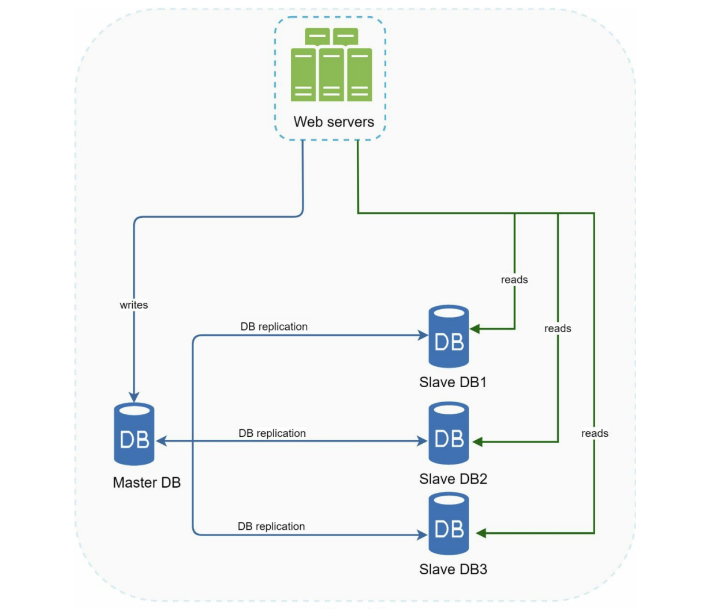

# Database Sharding: Slicing the Data Pizza

Imagine you have a giant pizza. It's too big for one person to eat, and it's too big for one box to hold. So, what do you do? You slice it up and give different pieces to different friends.

In the database world, we call this **Partitioning**. We divide the data into smaller, manageable chunks so that no single server has to carry the entire load.

### Horizontal vs. Vertical Partitioning

Before we dive into sharding, it's important to know there are two ways to slice this pizza:

1.  **Vertical Partitioning:** This is like separating the crust, the cheese, and the toppings into different boxes. You take specific **columns** (attributes) of your data and move them to different servers.
2.  **Horizontal Partitioning (Sharding):** This is what we usually mean when we talk about sharding. It separates large databases into smaller, more easily managed parts called shards. Each shard shares the same schema, though the actual data stored on each shard is unique.

### How Sharding Works and the Sharding Key

The most critical factor to consider when implementing a sharding strategy is the choice of the **sharding key** (also known as a partition key). This key consists of one or more columns that determine how data is distributed.

For example, if we use `user_id` as the sharding key across 8 database servers ($S_0$ to $S_7$):

- Server $S_0$ handles `user_id` 0 to 100.
- Server $S_1$ handles `user_id` 101 to 200.
- ...and so on.

The sharding key allows the system to retrieve and modify data efficiently by routing database queries to the correct server. When choosing a sharding key, one of the most important criteria is to choose a key that distributes data and request volume evenly.

> [IMPORTANT]
> These are **database servers**, not your typical stateless application servers. While an app server can be easily swapped out, a database server holds the "truth" of your data. It can't afford any "hiccups."

### The Golden Rules: Consistency & Availability

In system design, we often talk about the trade-off between **Consistency** (everyone sees the same data at the same time) and **Availability** (the system is always up).

When it comes to databases:

- **Consistency is King:** In most data-heavy applications, it's better for a request to wait a millisecond than to see "garbage" or outdated data.
- **Availability is Critical:** Obviously, we don't want the database to crash, but we often prioritize data integrity over 100% uptime if a conflict occurs.

### Smart Sharding

You can shard your database on any meaningful data. For example, in an app like **Tinder**, you might shard by **Location**. This way, when you query for people near you, the database only has to look at one specific shard instead of searching the entire world.

To make it even faster, you can create **Indexes** on each shard. If you're looking for someone in "NY" between ages "20-25", the system goes to the "NY" shard and then uses an index on the "Age" column to find the result instantly.

---

## The Catch: Sharding Problems

Sharding is a powerful scaling technique, but it introduces several complexities:

### 1. Join and De-normalization

Once a database has been sharded across multiple servers, performing join operations across shards is difficult and inefficient because you must retrieve data from different machines over the network. A common workaround is to **de-normalize** the database so that queries can be performed within a single table.

### 2. Resharding Data

Resharding is required when:
1. A single shard can no longer hold more data due to rapid growth.
2. Certain shards experience shard exhaustion faster than others due to uneven data distribution.

When shard exhaustion occurs, you must update the sharding function and move data across servers.
- **Consistent Hashing:** A commonly used technique to solve this problem by minimizing the amount of data that needs to be moved when shards are added or removed.
- **Hierarchical Sharding:** If a shard gets too full, you dynamically split it into smaller "mini-shards."

### 3. The Celebrity Problem (Hotspot Key Problem)

Excessive access to a specific shard can cause server overload. For example, in social applications, if data for popular users (like Katy Perry, Justin Bieber, and Lady Gaga) ends up on the same shard, that database server will be overwhelmed with read operations. To resolve this, you may need to allocate dedicated shards for high-traffic keys, or partition them further.

---

## Database Replication (Master-Slave Architecture)

Database replication is used to keep copies of your data across multiple servers, usually through a **master/slave** relationship. The original is called the master, and the copies are called slaves.

The split is pretty straightforward: the **master** handles all write operations (inserts, updates, deletes), while the **slaves** handle read operations by staying in sync with the master. Since most applications read data far more often than they write it, you'll typically see more slave databases than master ones in a real system.

<!-- Credits: Alex Xu - System Design Interview -->

### Why Bother Replicating?

- **Better performance:** Writes go to the master, reads spread across slaves. More queries run in parallel, and the whole system feels faster.
- **Reliability:** If a server gets wiped out (hardware failure, natural disaster, whatever), your data still lives on the other replicas. No data loss.
- **High availability:** If one database goes offline, the others can serve requests. The system keeps running even during failures.

### What Happens When Something Goes Down?

- **A slave goes offline:** If there's only one slave and it goes down, reads temporarily fall back to the master until a replacement slave is spun up. If there are multiple slaves, reads just get redirected to the remaining healthy ones.
- **The master goes offline:** One of the slaves gets promoted to become the new master. All writes now go there. This sounds simple, but in practice it can get messy. The promoted slave might not have the very latest data, so recovery scripts may need to run to fill in the gaps. More advanced setups like multi-master or circular replication exist but are significantly more complex.

## Wrap Up

Conceptually, sharding is easy: break data into pieces and spread them out. In practice, it’s one of the hardest things to get right because maintaining **Consistency** across multiple machines is a nightmare.

**Pro Tip:** If you're just starting out, try simpler concepts like **Indexing** or using a **NoSQL** database before jumping into full-scale sharding.
