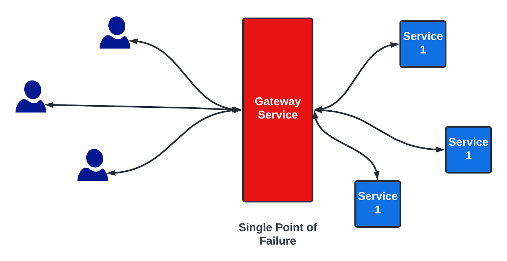

# Single Point of Failure (SPOF)

A **Single Point of Failure (SPOF)** is any part of a system that, if it fails, will stop the entire system from working.

Imagine you have a database and multiple servers calling it. If that one database crashes, your entire application goes dark. That database is your SPOF.

In the image above, if the **Gateway** crashes, the whole system crashes. It doesn't matter how many servers you have behind it if nobody can reach them.

### How to Kill the SPOF

The simplest way to handle a SPOF is **Redundancy**—having a backup. But not all backups are created equal:

1.  **Backup Nodes:** Having a "spare" server sitting idle sounds good, but if it doesn't have the current state or connections, it might not be useful when you need it most.
2.  **Database Mirroring:** This makes much more sense. You have a primary DB and a "mirrored" backup that copies everything in real-time. Now your data is resilient.
    - _Math check:_ If the probability of one DB failing is $P$, the probability of both failing at the same time is $P \times P$, which is significantly smaller.

### Evolutionary Architecture: User to Database

Let's look at how we evolve a simple system to remove SPOFs:

- **Step 1 (User-Server-DB):** The server is a SPOF.
  - _Solution:_ Add more servers.
- **Step 2 (Load Balancer):** Now you need a way to tell requests which server to go to. But the Load Balancer (Gateway) is now a SPOF!
  - _Solution:_ Add multiple Gateways.
- **Step 3 (DNS):** To route users to multiple Gateways, we use **DNS** with multiple IP addresses resolving to the same hostname (e.g., `facebook.com`).
- **Step 4 (Database):** We use **Master-Slave Architecture** with multiple DBs to ensure the data layer isn't a SPOF.

The final, resilient flow looks like this:
**User $\rightarrow$ DNS $\rightarrow$ Gateway (LB) $\rightarrow$ Server $\rightarrow$ Database**

### Regional Failover & Chaos Engineering

Even with all these fixes, a system can still fail if the entire data center loses power. To solve this, you need to distribute your system across **multiple regions** (e.g., US-East and US-West).

How do companies like **Netflix** know their system is actually safe? They use something called **Chaos Monkey**. It’s a tool that intentionally goes around and "kills" random nodes or services in their production environment just to prove that the system can handle it without the users ever noticing.

---

### Summary of Solutions:

1.  **More Nodes/Servers:** Don't rely on one machine.
2.  **Master-Slave / Mirroring:** Ensure your data is copied and ready to take over.
3.  **Multi-Region Deployment:** Protect against geographical disasters.
