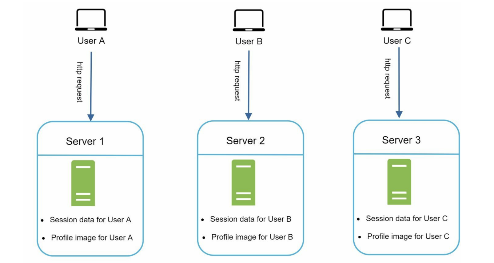
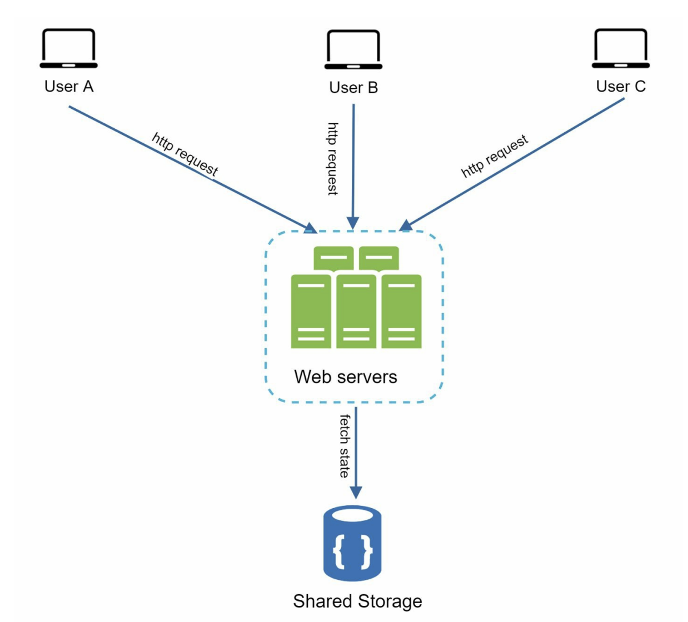

# Stateful and Stateless Architecture

## Stateless Web Tier

At some point, you will want to scale your web tier horizontally, meaning you want to add more web servers to handle more traffic. But there is a catch: if your servers are remembering things about users (like who is logged in), you have a problem on your hands.

The fix is to move that state data, like user session information, out of the web servers entirely. Instead, you store it in a persistent storage layer like a relational database or a NoSQL store. Every web server in your cluster can then look up session data from the database whenever it needs it. This setup is called the **stateless web tier**.

---

## Stateful Architecture

Before we get into how stateless works, let's understand what we are trying to move away from.

A **stateful server** remembers client data from one request to the next. A **stateless server** does not hold on to any of that information. The state is stored elsewhere, and the server just does its job and moves on.

Here is what a stateful architecture looks like:

<!-- Credits: System Design Interview - An insider's guide by Alex Xu -->

In this setup, User A's session data and profile image live on Server 1. So every single request from User A has to go to Server 1. If it accidentally lands on Server 2, authentication fails because Server 2 has no idea who User A is. Same story for User B always going to Server 2, and User C always going to Server 3.

This is where it gets painful. Every client is basically married to one specific server. Load balancers can enforce this using **sticky sessions**, which sound cute but are actually a headache. Adding or removing servers becomes a complicated operation, and if a server goes down, all the users tied to it are suddenly locked out. Not ideal.

---

## Stateless Architecture

Now here is the better way to do things:

<!-- Credits: System Design Interview - An insider's guide by Alex Xu -->

In a stateless architecture, HTTP requests from any user can go to any web server. It does not matter which one picks it up, because none of them are storing session data locally. Instead, they all pull the session data from a **shared data store** whenever they need it.

The web servers become interchangeable. Any server can serve any user at any time. This makes the system simpler, more robust, and much easier to scale.

---

## Moving the Session Data Out

So where does the session data actually live? You move it into a persistent data store that all your web servers can reach. The options are flexible:

- Relational databases
- Memcached or Redis (in-memory caches)
- NoSQL stores

NoSQL is often the preferred choice here because it is very easy to scale. And once the session data is out of the web servers, you unlock a powerful capability: **autoscaling**.

Autoscaling means you can automatically add or remove web servers based on how much traffic is coming in. During a traffic spike, spin up more servers. During quiet periods, scale back down. Since no server holds any unique state, none of them are special and all of them are replaceable.

---

## What Comes Next

Once you have a stateless web tier humming along nicely, you will start running into the next natural challenge. Your website keeps growing, users are showing up from all over the world, and now latency becomes a real concern. The answer to that is supporting **multiple data centers** across different geographical regions, which helps with both availability and speed for users no matter where they are logging in from.

But that is a story for the next section.
