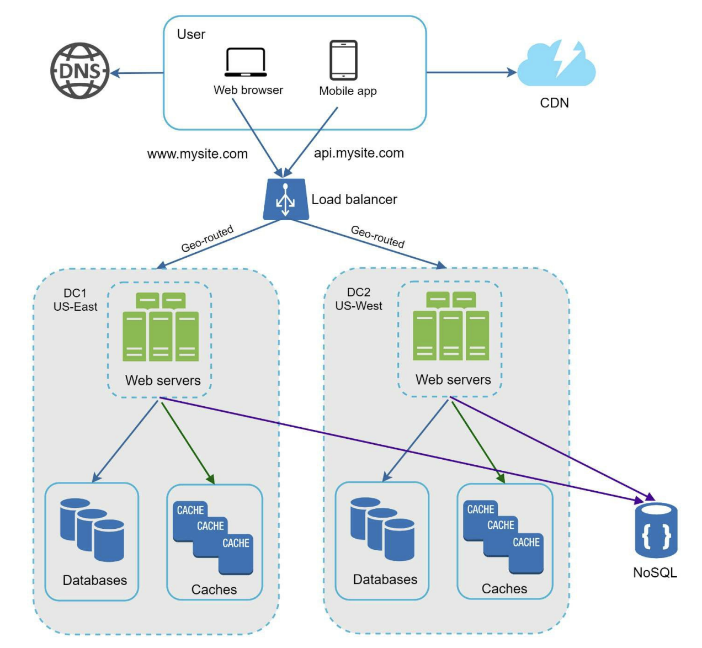

# Data Centers

As your app grows and users start showing up from all corners of the world, a single data center is no longer going to cut it. Latency creeps in, availability suffers, and one bad outage takes everyone down at once. The answer is supporting **multiple data centers**.

---

## How It Works

Here is a typical two-data-center setup:

<!-- Credits: System Design Interview - An insider's guide by Alex Xu -->

In normal operation, users are **geoDNS-routed** (also called geo-routed) to the data center closest to them. geoDNS is a DNS service that resolves a domain name to different IP addresses depending on where the user is located. So users in the US-East region hit data center 1, and users in the US-West region hit data center 2, with traffic split something like x% going east and (100 - x)% going west.

---

## What Happens During an Outage

This is where multi-data-center setups really earn their keep. If data center 2 (US-West) goes offline, all traffic gets rerouted to data center 1 (US-East). Users might notice a slightly slower response depending on where they are, but the service stays up. No total blackout, no angry users refreshing a blank page.

---

## Challenges to Solve

Getting multi-data-center right is not just about spinning up two servers in different regions. There are a few real challenges you have to think through:

**Traffic redirection**
You need something smart routing users to the right data center. GeoDNS handles this well since it directs traffic based on the user's physical location, sending them to whichever data center is nearest.

**Data synchronization**
Different regions might have their own local databases or caches. In a failover scenario, traffic gets redirected to a data center that may not have all the latest data. The common fix here is to replicate data across data centers asynchronously. Netflix, for example, has a well-documented approach to asynchronous multi-data-center replication that is worth looking up.

**Testing and deployment**
With servers spread across multiple regions, you need to make sure your app works correctly in each one. Testing from different locations catches region-specific bugs early. Automated deployment tools are also essential so that every data center runs the same version of your code at all times. Manual deployments across regions are a recipe for inconsistency and late-night debugging sessions.

---

## What Comes Next

Multi-data-center gets you a long way in terms of availability and global reach. But as traffic keeps scaling, you also need the internals of your system to scale independently. Tightly coupled components become a bottleneck fast. The next step is **decoupling** those components so they can grow on their own terms, and the key tool for that is the **message queue**.
