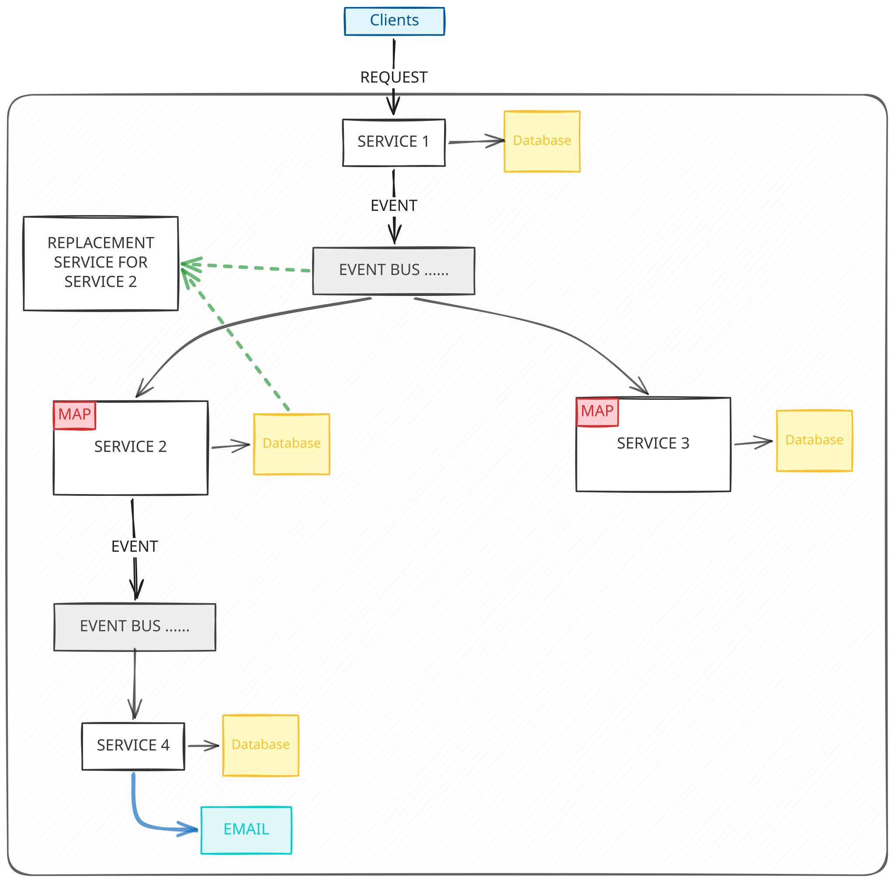

# Event-Driven Architecture (EDA)

Ever wonder how sprawling systems actually keep track of what's going on without constantly shouting at each other? Let's talk about Event-Driven Architecture.

## Request-Response vs. Event-Driven

To understand EDA, we first need to look at the standard **Request-Response** model.
In Request-Response, a service actively _asks_ for something. "Hey Server B, give me user 123's data." The client sends a request, waits, and the server responds.

**Event-Driven Architecture**, on the other hand, is more like broadcasting news.
A service simply says, "Hey everyone, something just happened here!"

- The client sends a request to a server.
- The server does its thing and internally fires an **event** to an **Event Bus** stating that its state has changed.
- Other servers (**Subscribers**) are listening to this Event Bus. They consume the event, check if it's relevant to them, and update their own internal state accordingly.
- The core philosophy: A service publishes an event when it thinks others might need to know something, rather than specifically asking another service to do something.

### The "Headshot" Game Server Example

Let's say you're Player 1, playing a multiplayer shooter. There's a server sitting between you and Player 2.

- At `t = 50s`, you take a clean headshot at Player 2, who is standing at position 9.
- By the time your shot reaches the server, it's `t = 51s`, and Player 2 has moved to position 10.
- In a pure Request-Response system, the server checks Player 2's _current_ position (10), compares it to where you aimed (9), and says you missed. Tragic.
- **In an Event-Driven system**, events are marked with timestamps. The server can essentially rewind the event log, look at the state of the world specifically at `t = 50s`, see that Player 2 _was_ indeed at position 9, and award you the headshot.

Other massive systems that use this concept heavily:

- **Git**: Every commit is essentially an event being stored!
- **React** and **NodeJS** ecosystems.

_Rule of thumb: If Event-Driven Architecture isn't acting quickly enough for your needs or feels like a forced fit for your specific module, don't pursue it. It's powerful, but not a silver bullet._

---

## Data Storage & The State Flow

In standard microservices, each service keeps to itself. A service only stores data that is strictly relevant to its own domain.

In EDA, things get a bit more communal.
When Server S1 publishes an event, Server S2 might consume it and store that event's persistent data in its _own_ local database. S2 adds relevant fields so it has local access to data that originated from S1.

**Why do this?**

- To free up the Event Bus.
- **Autonomy**: If Server S1 crashes and burns, S2 doesn't care! It already saved the relevant information locally. It never has to ask S1 for anything synchronously.

---

## The Advantages of EDA

1. **High Availability**: Because services store relevant event data locally (like S2 storing S1's data), the system keeps running even if individual services go down.
2. **Easy Rollback & Debugging**: Since you have an **Event Log** (a literal history of everything that happened stored in a database), tracking down bugs is amazing. You can roll the system state back to any specific point in time to see exactly what went wrong.
3. **Smooth Server Replacements**: Want to replace Server S2 with a brand new Server S5? Easy. Just take the historical events from S2's database, replay them into S5, and tell the Event Bus to start routing new events to S5. Boom, seamless replacement without downtime or lost state.
4. **Knowledge of Intent**: When you store events, you aren't just storing current data; you are storing the _intent_ behind the changes. If you replace a service later, knowing this context allows you to build completely different features based on the original user intentions.
5. **Transactional Guarantees**: Messaging through the bus gives you control over delivery.
   - **At most once**: Fire and forget. Send it once, and if a service misses it, whatever.
   - **At least once**: Keep replaying the message to the service until you get an absolute confirmation that it was received and processed.

---

## The Disadvantages of EDA

Of course, all this magic comes with a cost.

1. **The Consistency Problem**: That sweet High Availability introduces a massive headache: Inconsistency. If data changes in S1, but S2 hasn't consumed that update from the Event Bus yet, S2's database is working on outdated information.
2. **Not Applicable for Gateways (External Systems)**: Imagine Server S4's job is to send emails to users. If you try to replace S4 and replay its events from the log... you're going to spam real people with thousands of duplicate emails! Time-bound, real-world actions cannot simply be "replayed" or undone.
3. **Lesser Control**: In Request-Response, you dictate exactly _who_ handles a request and _how long_ they have to do it (timeouts). In EDA, you toss an event into the bus. You have very little control over when (or even if) a subscriber picks it up and processes it within your desired timeframe.
4. **Event Bus Complexity**: Security and filtering become a nightmare. If an event contains sensitive information, how do you strictly ensure only authorized services consume it? The logic inside the event bus gets very complicated very quickly when managing who is allowed to see what.
5. **The Compaction Issue**: Finding a specific state in an infinite log of events is slow.
   - _Replaying from the start_ is too slow for big systems.
   - _Undo-ing recent events_ often isn't mathematically or literally possible (again, you can't un-send an email).
   - _Diff-based_ generation takes effort.
   - **The Fix**: Compaction! You periodically "squash" events up to a certain point (e.g., daily snapshots) so services can just load the snapshot instead of replaying the entire history of the world.

### Developer Headaches

- **Hidden Flow**: It is notoriously hard to figure out what the system is actually doing. If you look at Service 1's code, all it says is `publish(Event)`. To find out what happens next, you have to track down the Event Bus config and hunt for every single subscriber. The "flow" of logic is completely hidden.
- **Migration is a Pain**: Trying to convert a specific service back to a Request-Response model once it's deeply integrated into an event-driven system is incredibly disruptive to the overall flow.
