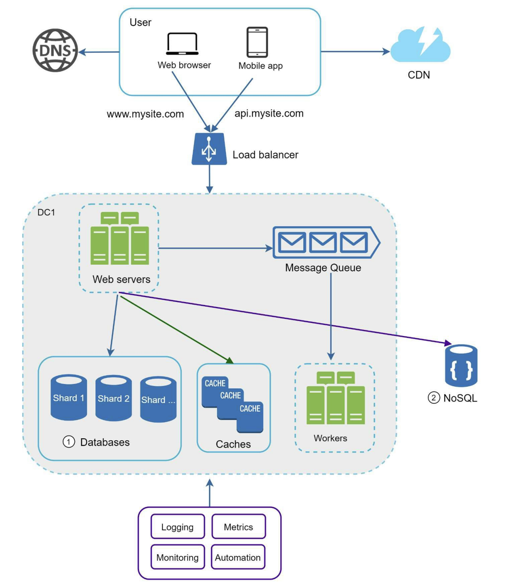

# Logging, Metrics, and Automation

If you run a busy pizza shop with dozens of chefs, drivers, and ovens, you cannot manage it effectively if you do not know what is happening in real-time. You need to know if a chef burned a pizza, if a delivery driver is delayed, or if an oven is overheating. 

In software engineering, this visibility is called **observability**, and it is achieved using three main pillars: **logging**, **metrics**, and **automation**.

---

## Logging: The Event Diary

A log is a timestamped record of a discrete event that occurred in the system. 

If a customer complains that their pizza arrived late and cold, you look at the shop's logs to trace the history of that specific order:

* **12:00 PM:** Order #983 (1x Pepperoni) received.
* **12:05 PM:** Chef Mario started preparing the dough.
* **12:15 PM:** Order #983 placed in Oven #2.
* **12:30 PM:** Pizza #983 boxed and handed to Driver Luigi.
* **1:45 PM:** Driver Luigi marked Order #983 as delivered.

The logs show that the kitchen prepared the pizza in 30 minutes, but the delivery took 1 hour and 15 minutes. This pinpoints the delivery process as the bottleneck.

### Unstructured vs. Structured Logs

Logs can be written as unstructured plain text or structured formats like JSON. Structured logs are much easier to query and analyze at scale.

#### Unstructured Log:
```text
[2026-06-28 17:58:00] INFO Order 983 processed successfully by Mario in 15 mins.
```

#### Structured Log:
```json
{
  "timestamp": "2026-06-28T17:58:00Z",
  "level": "INFO",
  "event": "order_processed",
  "order_id": 983,
  "chef": "Mario",
  "duration_minutes": 15,
  "status": "success"
}
```

With structured logs, you can easily query your logging database for specific patterns, such as searching for all orders handled by "Mario" that took longer than 30 minutes.

### Log Levels

We categorize logs by severity levels to filter out noise and highlight issues:

| Level | Pizza Shop Analogy | Tech Definition |
| :--- | :--- | :--- |
| **`DEBUG`** | "Chef added 14 slices of pepperoni." *(Low-level detail for troubleshooting)* | Detailed diagnostic information. |
| **`INFO`** | "Order completed." *(Standard operational events)* | Normal system behavior, like starting a service or a user logging in. |
| **`WARN`** | "Oven thermometer is flickering, but temperature is okay." *(Potential future issue)* | Non-critical anomalies (e.g., slow database queries). |
| **`ERROR`** | "Oven #2 stopped working." *(A specific feature failed, but operations continue)* | A functional failure (e.g., payment processing failure). |
| **`FATAL`** | "The kitchen caught fire." *(Complete system failure)* | Critical failures that crash the application (e.g., out-of-memory errors). |

---

## Metrics: The Dashboard

While logs record individual events, metrics track aggregated numeric data over time. Instead of reading individual logs, you look at a metrics dashboard to understand overall system health.

Most monitoring systems (like Prometheus) use three main types of metrics:

### Counters
A counter is a value that only increases (or resets to zero on restart).
* **Pizza Analogy:** Total pizzas sold.
* **Tech Example:** Total HTTP requests received, or total error count.

### Gauges
A gauge is a single value that can increase or decrease.
* **Pizza Analogy:** Current temperature of an oven, or the number of chefs in the kitchen.
* **Tech Example:** CPU usage, memory usage, or active connections.

### Histograms & Summaries
Histograms group measurements (like durations or sizes) into buckets to show their distribution. 

Relying on averages can be misleading. If 90% of pizzas are delivered in 10 minutes, but 10% take 2 hours, the average delivery time seems fine, but a tenth of your customers are experiencing major delays. 

Histograms provide percentile distributions:
* **p50 (Median):** 50% of orders were delivered in under 12 minutes.
* **p99:** 99% of orders were delivered in under 45 minutes.
* **Tech Example:** HTTP request latencies.

---

## Alerting and Automation

You cannot monitor dashboards manually around the clock. You need automated alerts and actions when metrics cross defined thresholds.

### Alerting
Alerts notify engineers when metrics indicate an anomaly or failure.
* **Pizza Analogy:** If the oven temperature exceeds 300°C, sound an alarm.
* **Tech Example:** Send a notification to PagerDuty if the error rate spikes.

#### Prometheus Alerting Rule Example:
```yaml
groups:
  - name: pizza_shop_alerts
    rules:
      - alert: HighErrorRate
        expr: rate(http_requests_total{status="500"}[5m]) > 10
        for: 2m
        labels:
          severity: critical
        annotations:
          summary: "Oven is burning the pizzas (High 500 Error Rate)"
```
*(This rule triggers an alert if the server returns more than 10 internal server errors (500 status codes) per second for 2 consecutive minutes.)*

### Automation (Self-Healing)
Automation systems can respond to metrics and take corrective actions without human intervention.

1. **Auto-Scaling:** If the incoming order rate spikes, the system automatically provisions more servers (adding more chefs) to handle the workload, and then scales down when traffic drops.
2. **Auto-Restart:** If a server stops sending heartbeat signals, the automation platform automatically terminates and replaces it.

---

## Common Observability Tools

Modern systems leverage established open-source and commercial tools to handle observability:

* **Logging (Collection & Analysis):**
  - **ELK Stack** (Elasticsearch, Logstash, Kibana) or **Grafana Loki** to index, search, and analyze log data.
* **Metrics (Collection & Storage):**
  - **Prometheus** or **Datadog** to collect, store, and query time-series metrics.
* **Visualization (Dashboards):**
  - **Grafana** to query and display metrics on visual dashboards.
* **Alerting:**
  - **PagerDuty** or **Opsgenie** to route alerts to on-call teams.

---

## Complete System Architecture

All the scaling, caching, replication, and observability concepts combine to form a complete system architecture:



<!-- Credits: Alex Xu - System Design Interview -->