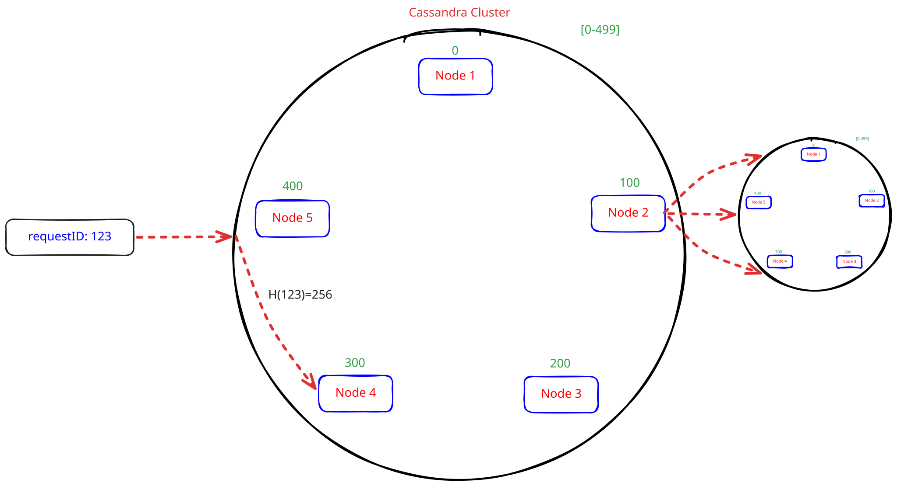

# NoSQL Databases: To Blob or Not to Blob?

Let's talk about **NoSQL** databases. You've probably heard the hype, but just because it's new and shiny doesn't mean you throw your trusty old SQL database out the window. There are perfect moments to use NoSQL, and equally valid reasons to stick with a classic RDBMS.

Let's break down how they actually store your data.

## The Storage Showdown: Tables vs. The "Fat Blob"

In a traditional **RDBMS** (like MySQL or PostgreSQL), everything is highly structured and relational. It's like a strict filing cabinet.

If we want to store user data, it looks like this:

**User Table:**

| ID  | Name     | Address ID | Age | Role |
| :-- | :------- | :--------- | :-- | :--- |
| 123 | John Doe | 123        | 30  | SDE  |

**Address Table:**

| Address ID | City   | Country | District |
| :--------- | :----- | :------ | :------- |
| 123        | Munich | Germany | `null`   |

Notice that `Address ID`? That's a foreign key pointing to another table. And look at `District`—it's empty (`null`), but we still have to keep the column around for everyone just in case!

---

Enter **NoSQL** (like MongoDB or DynamoDB). NoSQL throws out the strict tables and says, "Hey, just give me everything at once!" Data is typically stored as a rich, nested JSON "blob".

<table>
  <thead>
    <tr>
      <th>ID</th>
      <th>Value (The Blob)</th>
    </tr>
  </thead>
  <tbody>
    <tr>
      <td valign="top">123</td>
      <td>
<pre lang="json">
{
  "Name": "John Doe",
  "Address": {
    "id": 123,
    "city": "Munich",
    "Country": "Germany"
  },
  "Age": 30,
  "Role": "SDE"
}
</pre>
      </td>
    </tr>
  </tbody>
</table>

### Notice the magic here?

- **No Foreign Keys:** The address is completely nested inside the user object.
- **Goodbye Nulls:** Since John Doe doesn't have a district, we simply _didn't write it_. The JSON schema doesn't care!

The real secret sauce of NoSQL is how it handles storage and retrieval.
When you save a user, you don't save their name in one place and their address in another. The whole JSON blob usually arrives from the API and gets slammed into the database in exactly **one swift operation**.
And when you need to read John Doe's profile? You pull out the entire blob at once.

---

## Why NoSQL is Awesome (The Advantages)

1. **Lightning Fast Reads & Writes (For the whole blob)**:
   Because all related data is stored together in that one giant JSON object, insertions and retrievals are a breeze. In an SQL DB, the database engine has to scour different columns, hit a foreign key, and perform an expensive `JOIN` operation to fetch the address. NoSQL skips the middleman: you want the user, you get the whole user instantly.

2. **A Schema That Simply Doesn't Care**:
   Want to start tracking "Salary" for users?
   - **In SQL:** You have to alter the table structure. Depending on the size of the database, this could lock up the table or cause consistency nightmares.
   - **In NoSQL:** You just start adding `"Salary": 100000` to the new JSON blobs you insert. The older user blobs won't have it, and NoSQL is completely fine with that!

3. **Built for Massive Scale**:
   NoSQL databases are famously great at **horizontal scaling** (adding more servers). They are designed for high availability. If lots of systems need to access data fast and don't care about absolute, immediate consistency, NoSQL effortlessly spreads the load.

4. **Analytics & Aggregations**:
   Need to find the average age or filter by roles? Some NoSQL databases are heavily optimized to run big queries across these massive datasets, making them great for running metrics or pulling out key findings.

---

## Why NoSQL Might Ruin Your Day (The Disadvantages)

Okay, so why doesn't everyone use it?

1. **Updates Can Be a Nightmare**:
   NoSQL prioritizes availability over consistency (remember the CAP theorem?). Different nodes might temporarily hold different versions of the data. Relational databases solve this with **ACID** properties to guarantee absolute transactional safety. That's why your bank will _never_ use a basic NoSQL setup for your savings account!

2. **Fetching Specific Fields is Slow**:
   Let's say you _only_ want to calculate the sum of everyone's ages.
   - **In SQL:** The database jumps straight to the `Age` column and sums it up instantly.
   - **In NoSQL:** The database has to iterate through every single massive JSON blob, dig inside, find the `"Age"` key, and pull it out. It's much slower for reading specific granular fields.

3. **Say Goodbye to Internal Relationships (and Constraints)**:
   Remember that nice `Address ID` foreign key in SQL? That inherently forces a rule: _You can't add an address to a user if the address doesn't exist_. NoSQL has no implicit relations. If you mess up your code and write bad data into the blob, NoSQL won't stop you. Data integrity is entirely in the hands of your application logic.

4. **Joins? Oh, You Mean Pain?**:
   If your data naturally has a lot of relationships and requires complex joins across different entities, NoSQL will make you suffer. You'll have to pull both giant datasets into your application's memory and write the join logic yourself. Relational databases were practically born to do this efficiently.

---

## The Verdict

So, which one do you pick?

### SQL vs. NoSQL at a Glance

**SQL** databases support complex `JOIN` operations and provide strong data consistency and integrity for transactions through the **ACID** properties:

1. **Atomicity:** A transaction either completes entirely or fails entirely.
2. **Consistency:** Each transaction moves the data from one valid state to another valid state.
3. **Isolation:** Concurrent transactions are isolated from one another.
4. **Durability:** Committed data remains available even if the system fails.

**NoSQL** databases can handle highly dynamic, large data sets and are optimized for low latency and horizontal scalability.

Use **SQL** when data is well structured, has clear relationships, and needs strong consistency and transactional integrity. Use **NoSQL** when you need very low-latency responses, work with unstructured or semi-structured data, or need scalable storage for massive data volumes.

If you are building a **write-optimized** system (like an event logger or a rapidly changing user profile), NoSQL is fantastic.
However, massive platforms like **YouTube** or **StackOverflow** still heavily rely on RDBMS because their data is highly structured, deeply interconnected, and requires intense aggregations and specific field updates.

_Rule of thumb: Choose NoSQL when you need flexibility and fast full-object access. Stick to SQL when your data requires strict rules, relationships, and transactional guarantees._

---

## Deep Dive: Cassandra Architecture

Now let's zoom in on Cassandra's architecture. It’s one thing to say "NoSQL can scale," but _how_ does it actually pull it off?

Imagine a 5-node Cassandra cluster. (In the real world, hosting 5 massive nodes isn't cheap, but bear with me for this example!)

### 1. Hashing and Load Balancing: The Great Sorter

If a database gets millions of requests, how does it know which node should handle which request? Imagine we have Request IDs 0-100 going to Node 2, and 101-200 going to Node 3. Sounds simple, right?
But real-world data doesn't always have neat numeric IDs! A key could be a UUID, a person's name, or their email address.

Instead of guessing, Cassandra uses a **Hash Function**. It takes your messy key—let's say an email like `"john@doe.com"`—and runs it through a mathematical blender: `H("john@doe.com") = 256`.
Cassandra's nodes are arranged in a "ring." If the number `256` falls into Node 4's territory (Next node), boom, the request goes straight to Node 4.

If your hash function is well-designed, it scatters requests evenly like confetti. In a 5-node setup, every node handles a neat 20% of the load. Everyone is pulling their weight!

**But what if your hash function is terrible?**
Imagine you build a food delivery app, and you hash based on the _country_. On the night of Diwali or Thanksgiving, the poor node handling "India" or "USA" is going to get absolutely demolished and crash.

**The Hacky Fix:** You _could_ use a 2-layer cluster (sometimes called multi-level sharding). When Node 2 gets swamped, it acts as a middleman and forwards the traffic to an entirely new cluster of nodes, using a _second_ hash function (`H'`) to break up the traffic.
But honestly? That's messy. Why juggle multiple hash functions? Just pick a strong, uniform hash function from the start and let Cassandra do its thing!

### 2. Data Consistency: The Safety Net (Replication)

Okay, so what happens if Node 2 catches fire and dies? We can't just lose the data.

Enter **Replication**. Who gets the backup copies? Thanks to the neat ring structure we just talked about, Cassandra just walks down the line! If a piece of data belongs on Node 2, and we have a **Replication Factor (RF) of 3**, Cassandra will automatically push backup copies to Node 3 and Node 4 as well.

The probability of all three nodes catching fire at the exact same moment is basically zero. Plus, reading data gets way faster—if Node 2 is busy, Node 3 or Node 4 can step in and answer the query!

So Cassandra gives you two superpowers:

1. **Load Balancing** (spreading the work so reads/writes are lightning fast).
2. **Replication** (making sure your data survives a server meltdown) and **Redundancy** (speed reading from any of the nodes).

### 3. Distributed Consensus: The Board Meeting (Quorum)

Here is a super important question: If Node 2, 3, and 4 all hold the same data, how do they agree on what the _actual_ truth is?

Let's say I update my profile picture on Node 2. Node 2 immediately starts replicating this to Node 3 and Node 4. But networks are glitchy. Before the data reaches them, Node 2 crashes.
Now, I try to view my profile. Cassandra routes my request to Node 3. Node 3 looks at its storage and says, "Uh, I don't see a profile picture. `404 Not Found`."
_Wait! I just uploaded it!_

To solve this, Cassandra uses **Quorum**—essentially a democratic vote.
Quorum means a strict majority of nodes _must_ agree before an answer is accepted. If we have 3 copies of the data (RF=3), we might set a Quorum of 2.

If I ask for my profile picture, Node 3 and Node 4 will check with each other. They both agree they don't have it, so they confidently tell me it’s not there. BUT, let's say Node 3 _did_ receive the update right before Node 2 crashed. Node 3 says "I have the new picture!" and Node 4 says "I don't!". They compare timestamps, realize Node 3's data is newer, and boom—I get my profile picture back.

By requiring a Quorum of 2, Cassandra brilliantly dodges serving stale or incorrect data.

### 4. Storage: SSTables and Tombstones (How it actually saves to disk)

Finally, how does Cassandra write data to the hard drive so incredibly fast?

When a write request hits Cassandra, it doesn't waste time searching for the perfect spot on the disk. It just grabs the data and slaps it onto the end of an append-only **Log File** in memory. It's like writing on a giant continuous scroll—super fast!

Periodically, this scroll gets full, so Cassandra flushes it out to the permanent hard drive as an **SSTable** (Sorted String Table). It's called that because the keys are sorted before being saved.

Here's the catch with SSTables:

1. **They are Immutable:** Once saved, you can _never_ change an SSTable.
2. **They stack up:** Because the log file flushes periodically, you end up with hundreds of SSTables lying around.

This creates a weird scenario. Let's say I create user `123` with the name `"John"`. That goes into SSTable #1. A week later, I update the name to `"John Doe"`. Since SSTable #1 is locked, the update gets flushed into a brand new SSTable #5.
Now I have two records for user `123`! Which one is right? Again, Cassandra just checks the timestamps and returns the latest one.

**The Space Problem (Compaction):**
Having duplicate keys everywhere wastes a ton of disk space. To fix this, Cassandra runs a background janitor process called **Compaction**. It takes two older SSTables and merges them together, throwing away the old stale data. If you remember your Data Structures class, it's _exactly_ like merging two sorted arrays! (Time complexity: $O(N)$, Space complexity: $O(\min(N, M))$).

**The Deletion Problem (Tombstones):**
If SSTables can never be changed, how in the world do you delete something?
Cassandra uses a morbidly named feature called a **Tombstone**. When you delete a record, Cassandra doesn't actually delete it. It just writes a new record over it with a Tombstone flag that basically screams, _"He's dead!"_
If a read query sees a Tombstone, it pretends the data doesn't exist. If an update query hits a Tombstone, it throws an error. Eventually, during the Compaction process, the background janitor sees the Tombstone and finally sweeps the dead data off the disk for good!
